# 🥗Dishcovery: Personalized Recipe Recommendation System
Dishcovery：个性化食谱推荐系统

Dishcovery is a Django-based web application that helps users discover, save, and share personalized recipes.

## Features

- **Personalized Meal Recommendations**  
  Suggests recipes based on user preferences and dietary needs.

- **Search & Filter Functionality**  
  Easily search for recipes by keyword, cuisine, ingredient, or category.

- **User Accounts**  
  Register, login, and manage your personal profile.

- **Save & Manage Meals**  
  Users can bookmark meals, rate them, and leave reviews.

- **Image Support**  
  Visual representation of each dish enhances usability and experience.

- **Admin Interface**  
  Manage recipes, users, and reviews with Django's built-in admin panel.

## Sample Screenshots

| Homepage | Login | Register |
|---------|-------|----------|
| 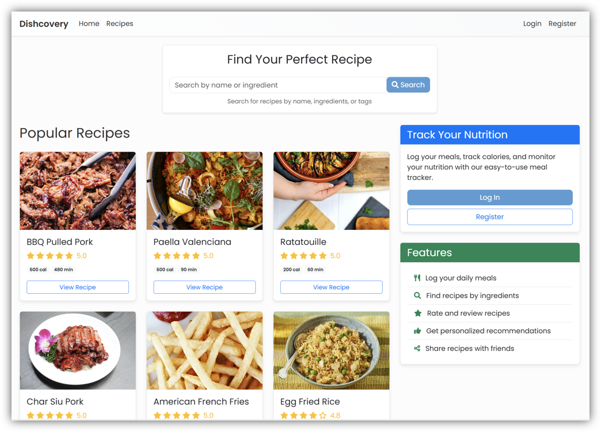 | 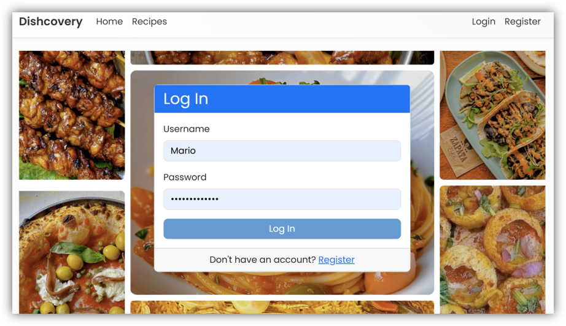 | 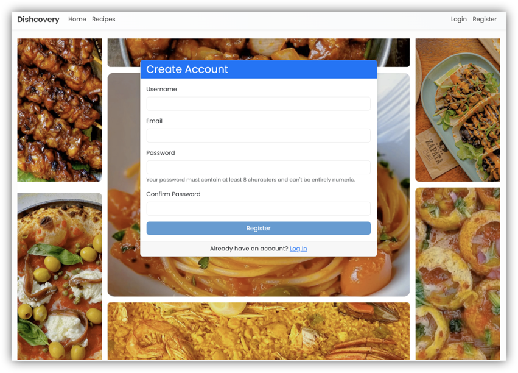 |

| Recommendation | Profile | My Meals |
|----------------|---------|----------|
| 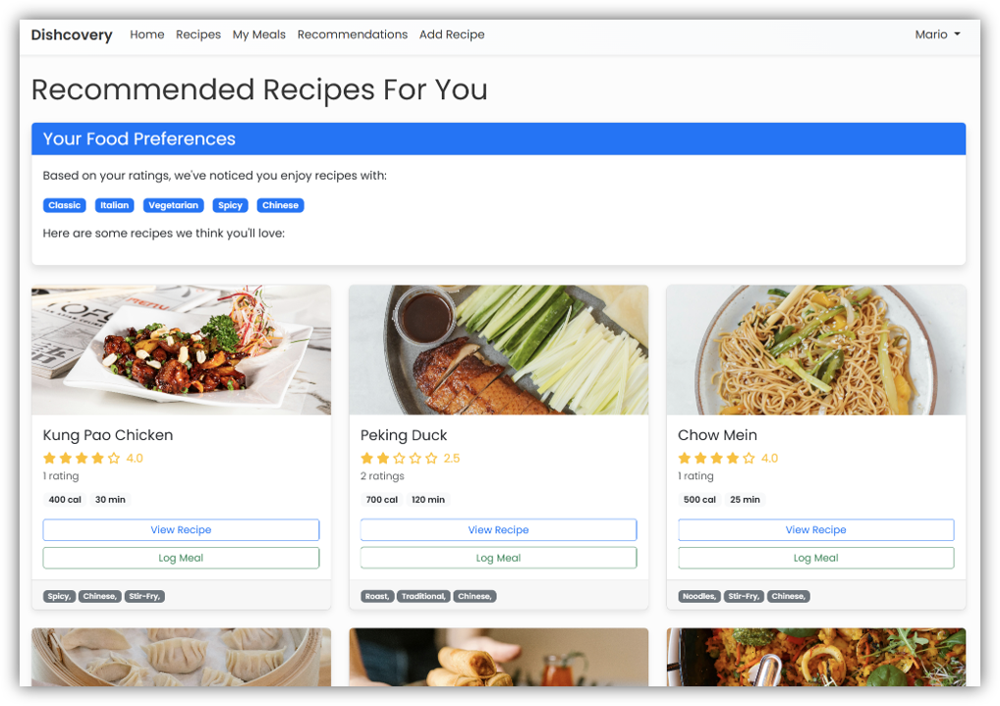 | 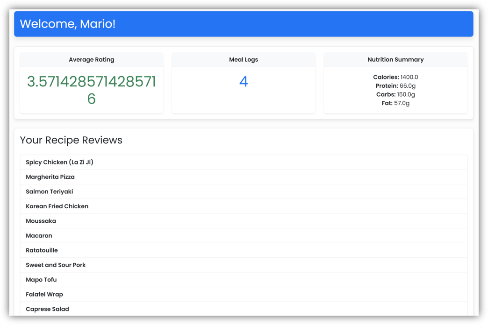 | 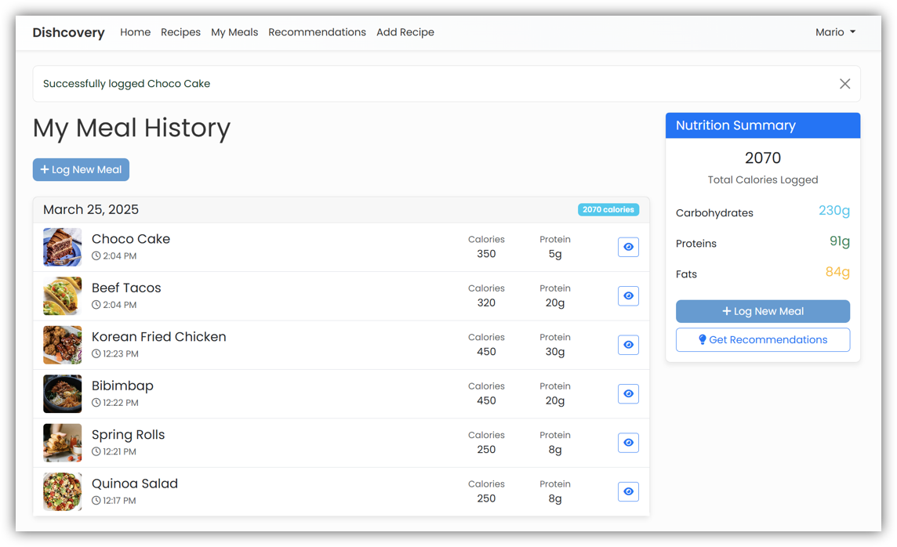 |

| Search | Edit Recipe | Rating & Reviews |
|--------|-------------|------------------|
| 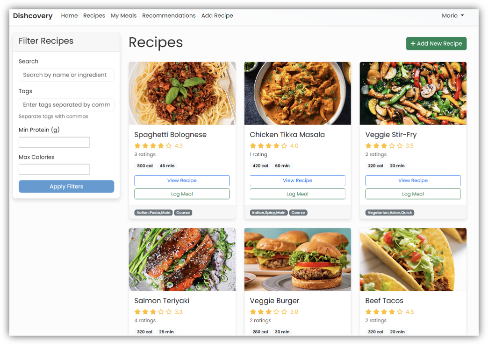 | 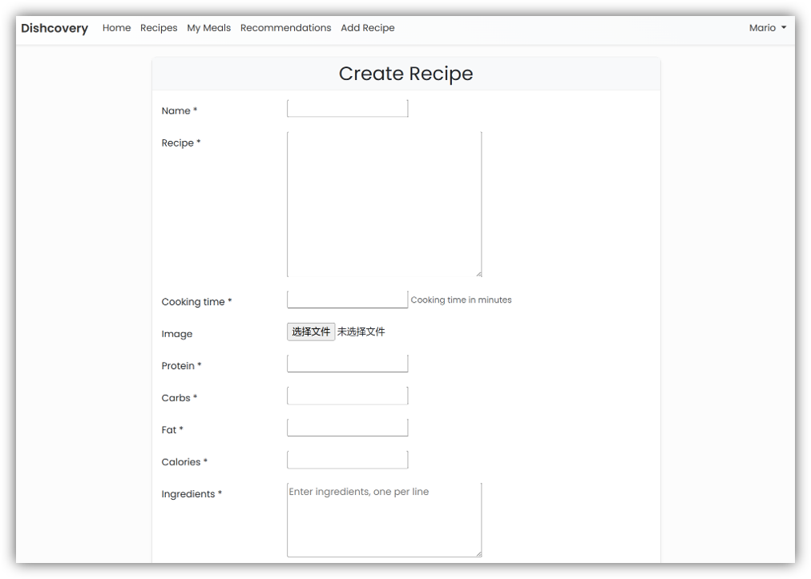 | 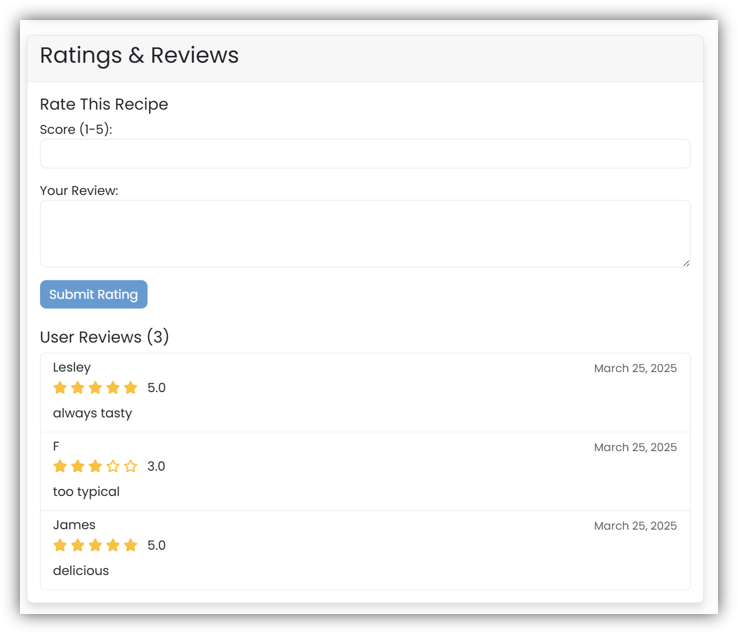 |

| Print View | Recipe 1 | Recipe 2 |
|------------|----------|----------|
| 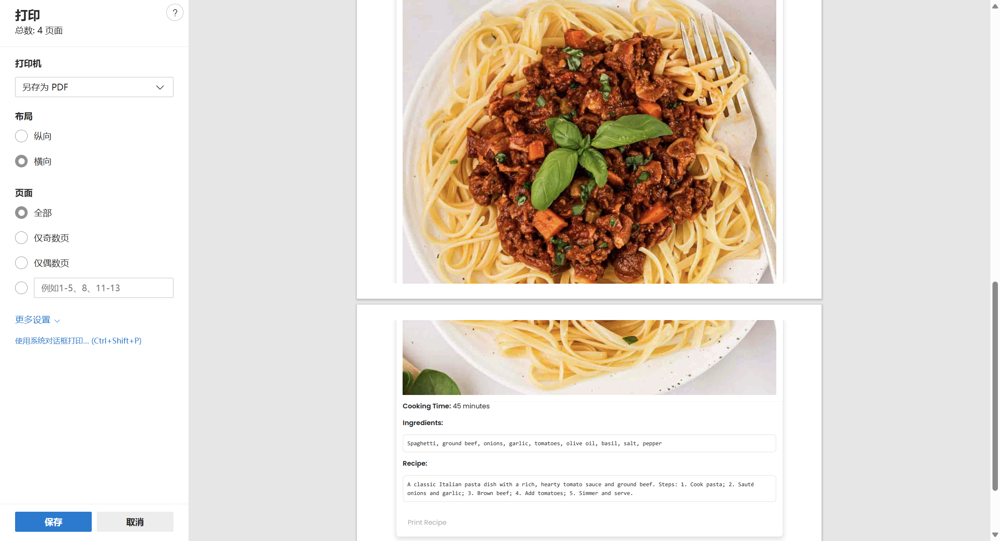 | 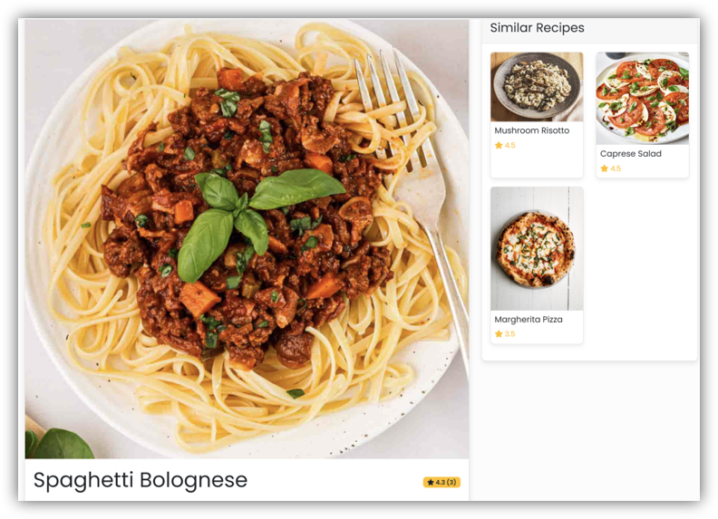 | 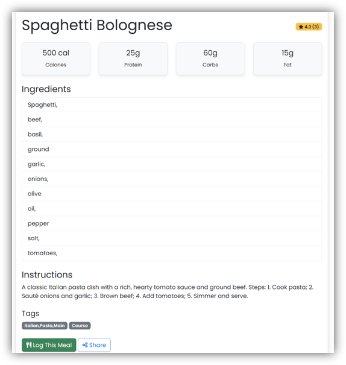 |

## Tech Stack

- **Backend:** Django (Python), SQLite3
- **Frontend:** HTML5, CSS3, JavaScript
- **Media:** Static images of food stored locally in `media/recipes`
- **Version Control:** Git + GitHub

## Project Structure

```
recipe-recommendation-system/
├── core/                    # Core logic and utility functions
├── dishcovery/              # Django app with views, models, urls, etc.
├── media/
│   └── recipes/             # Image assets for recipes
├── db.sqlite3               # SQLite database file
├── manage.py                # Django project management script
├── requirements.txt         # Python dependencies
├── README.md                # Project documentation
```


## Timeline

| Period         | Task                                 |
|----------------|--------------------------------------|
| Jan 2024       | Project setup & team collaboration   |
| Feb 2024       | Backend, database, and UI development |
| Late March 2024 | Final optimization and feature testing |

---

## Future Work

- Integrate machine learning for personalized nutrition recommendations
- Add real-time calorie targets and dynamic dietary suggestions
- Enable recipe upload by users (image + nutrition auto-fill)
- Mobile-friendly design and PWA support
- Import/export user data for long-term tracking

---

## Author
Xinyu Dai

Email: xinyudai2002.career@gmail.com
